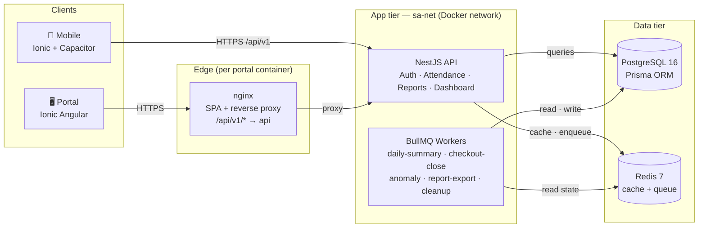

# Architecture — Smart Attendance

Tài liệu kiến trúc deployment + scale + trade-offs + known limitations.
Business rule + schema xem [`spec.md`](spec.md), [`erd.md`](erd.md), [`api-spec.md`](api-spec.md).

---

## 1. System overview

Same process runs **API + BullMQ workers** in the MVP (single Node container).
Worker classes (`@Processor` decorators) are wired into NestJS DI alongside HTTP controllers.
Production scale-out splits them — see §3.

---

## 2. Layer responsibilities

| Layer     | Tech                            | Scope                                                                                     |
| --------- | ------------------------------- | ----------------------------------------------------------------------------------------- |
| Mobile    | Ionic 8 + Capacitor 8 (Angular) | Employee check-in/out, history, profile                                                   |
| Portal    | Ionic 8 + Angular 20 standalone | Admin/Manager: branches, employees, attendance, dashboard, anomalies, CSV export          |
| Edge      | nginx 1.27-alpine               | SPA serve, gzip, `/api/v1/*` reverse proxy, CSV stream-through (`proxy_buffering off`)    |
| API       | NestJS 11 + Prisma 6            | REST `/api/v1/*`, JWT auth, RBAC guards, validation, business logic                       |
| Workers   | BullMQ 5 + @nestjs/schedule 6   | Cron jobs (daily summary, missing checkout close, anomaly detection), CSV export, cleanup |
| Cache     | Redis 7 + cache-manager         | Branch config (TTL 5m), dashboard aggregate (TTL 60s), anomaly snapshot (TTL 1h)          |
| DB        | PostgreSQL 16                   | Source of truth; read model `daily_attendance_summaries` for dashboard                    |
| Container | Docker Compose v2               | One-command boot of 4 services with healthchecks + dependency ordering                    |

---

## 3. Scale strategy — 100 branches × 5.000 employees

**Peak load math:** giờ cao điểm 07:45–08:15 (30 phút).

- 5.000 nhân viên × ~1.2 attempts/người = 6.000 requests
- Phân bổ đều trên 1.800 giây ≈ **~3 req/s trung bình, peak ~10 req/s**
- 1 NestJS instance dư khả năng (Node + Prisma typically handles 1.000+ req/s on commodity hardware)

**DB strategy:**

- Chỉ mục theo query pattern — xem [`erd.md` §4](erd.md): `(employee_id, work_date)`, `(branch_id, work_date)`, `(work_date, status)`
- Read model `daily_attendance_summaries` được populate bởi cron `daily-summary` 00:30 hằng ngày → dashboard truy vấn read model thay vì JOIN raw events. [`spec.md` §7](spec.md)
- Partition `attendance_events` theo tháng: kế hoạch sẵn (chỉ mục PK + `work_date`), MVP chưa bật (chưa cần ở quy mô seed).

**Cache strategy:**

- Branch config (geofence + WiFi) — TTL 5 phút, invalidate trên admin mutate. Dùng cho hot-path validation.
- Dashboard aggregate — TTL 60s. KPI không yêu cầu real-time strict.
- Anomaly snapshot — TTL 1h. Cron tính 01:00 sáng, dashboard đọc snapshot.

**Queue strategy (BullMQ + Redis):**

- `attendance-summary` — daily 00:30
- `attendance-checkout-close` — daily 23:59 (auto close missing checkout)
- `anomaly` — daily 01:00
- `report-export` — on-demand (T-016 CSV export)
- `report-export` cleanup — hourly

Heavy operation (CSV export 10k rows) **không block HTTP** — request trả 202 + jobId, frontend polls status.

**Horizontal scale path (chuẩn bị sẵn, MVP chưa apply):**

1. **API stateless** → đặt sau load balancer, scale theo CPU
2. **Worker tách container riêng** — `nx serve api --workers-only` flag (chưa implement) hoặc deploy 2 image variants từ cùng codebase
3. **Postgres read replica** cho dashboard query (đã có cache nên replica gain marginal ở MVP scale)
4. **Redis cluster** khi job queue throughput vượt single-node (~50k jobs/min)
5. **Object storage (S3-compatible)** cho CSV exports thay vì local `/tmp/reports/` (T-016 deferred)

**Rate limiting:**

- Login: 5/phút/IP — chống brute force
- Check-in: 10/phút/employee — UserThrottlerGuard tracker per user (không phải per IP, tránh starvation văn phòng dùng chung WiFi)
- CSV export: 3/phút (per-IP global throttler) — tránh disk fill

---

## 4. Trade-offs (neutral framing)

| Decision               | Chosen                          | Alternative                  | Why                                                                                                             |
| ---------------------- | ------------------------------- | ---------------------------- | --------------------------------------------------------------------------------------------------------------- |
| Mobile + Portal stack  | **Ionic Angular** cho cả 2      | Next.js + React Native       | Một skill set, code reuse `libs/shared`, faster MVP. Trade off: bundle size + DOM perf vs native                |
| Backend framework      | **NestJS 11**                   | Express + custom DI, Fastify | Out-of-box DI/validation/guards, ecosystem mature (Prisma + BullMQ + cache modules tích hợp tốt)                |
| ORM                    | **Prisma 6**                    | TypeORM, raw SQL (Knex)      | Type-safe migrations + autocomplete. Analytics raw-SQL exception documented [CLAUDE.md §8](../CLAUDE.md)        |
| Queue                  | **BullMQ + Redis**              | RabbitMQ, Kafka, AWS SQS     | Đã cần Redis cho cache → tận dụng. BullMQ + `@nestjs/schedule` hybrid simple cho cả cron + on-demand jobs       |
| Cache TTL              | **60s dashboard aggregate**     | WebSocket/SSE real-time      | KPI không yêu cầu real-time strict; cache giảm tải DB peak 100×. Defer realtime features                        |
| Mobile WiFi validation | **Stub (return null)**          | Native plugin                | Capacitor 8 ecosystem chưa có WiFi plugin maintained. Trust score cap ~55 (review level) — chấp nhận MVP        |
| Multi-platform Docker  | **amd64 only**                  | amd64 + arm64                | MVP build target; ARM build matrix → CI follow-up. Build time tăng 2× nếu bật cả 2                              |
| CSV streaming          | **`csv-stringify@6.7.0` Node**  | papaparse (browser-first)    | csv-stringify streaming-friendly + 0 peer deps. papaparse tối ưu cho parse browser, không phải stream Node      |
| File storage CSV       | **Local `/tmp/reports/`**       | S3-compatible storage        | MVP — accepts loss-on-restart. Cleanup scheduler hourly. Production migration to object storage straightforward |
| Per-user rate limit    | **Custom `UserThrottlerGuard`** | Default IP throttler         | Văn phòng dùng chung IP — IP-based starve nhân viên hợp lệ. Tracker key trên `user.id`                          |
| Image base             | **node:20-alpine**              | node:20-slim, distroless     | Alpine ~120MB vs slim ~250MB. Prisma v6 hỗ trợ linux-musl native                                                |
| Healthcheck command    | **Node `http.get`** zero-dep    | wget/curl in image           | Tránh thêm 1MB cho wget. Node luôn sẵn → use Node's `http` module trực tiếp                                     |

---

## 5. Known limitations (transparent)

1. **Mobile trust score cap ~55** — Capacitor 8 chưa có WiFi plugin maintained nào (npm 404 / abandoned). Mobile ops chỉ GPS + device fingerprint → Trust Score tối đa rơi vào "review" level (40-69). Tài liệu chấp nhận trade-off [`spec.md` §5.2](spec.md).
2. **API image 326MB** — vượt budget 300MB ~8.7%. Cấu thành: Node alpine ~120MB + Prisma client+CLI ~150MB + deps ~60MB. Đã trim multi-platform Prisma engines, WASM compilers cho 4 unused DBs, date-fns locales (giữ en-US), TypeScript types. Để giảm thêm cần distroless image hoặc bundle Prisma client custom build — defer.
3. **BullMQ workers chưa có `onModuleDestroy` shutdown hooks** — `tini` PID 1 forward SIGTERM đúng nhưng workers không gracefully đóng connection. Khi `docker stop` → ioredis connection dropped abruptly. Job retry mechanism (attempts: 3 + exponential backoff) bù lại cho jobs đang chạy. Follow-up: thêm `app.enableShutdownHooks()` + Worker.close().
4. **`cache-manager-ioredis-yet@2` silent fallback** — config qua URL nhưng instance fall back to in-memory store (xem ECONNREFUSED noise trong logs). Không ảnh hưởng functionality (cache vẫn work, chỉ là không persistent cross-process). T-014 đã document; giải pháp future: switch sang `@nestjs/cache-manager` v4 + `keyv` adapter.
5. **Mobile not Dockerized** — assignment scope giới hạn (employee app chạy local `nx serve mobile` hoặc Capacitor build cho device). Production deploy mobile = native app store, không phải Docker.
6. **CSV export storage local** — `/var/folders/.../T/smart-attendance-reports/` (host tmpdir). Không persist cross-restart, không scale-out friendly. Production migration → S3 — code đã structured để swap stream destination.
7. **No automated e2e** — Jest unit tests cover services + 11 risk-flag tests + 4 portal component tests. Manual smoke verify trong từng task plan. Cypress/Playwright e2e suite — defer to T-020.

---

## 6. References

| Topic                 | File                                                                                               |
| --------------------- | -------------------------------------------------------------------------------------------------- |
| Business rule         | [`spec.md` §2/§5/§6](spec.md)                                                                      |
| Schema + indexes      | [`erd.md` §3/§4](erd.md)                                                                           |
| API contract + errors | [`api-spec.md` §6/§10/§11](api-spec.md)                                                            |
| Trust score logic     | [`../libs/shared/utils/src/lib/trust-score.ts`](../libs/shared/utils/src/lib/trust-score.ts)       |
| Risk flag map (i18n)  | [`../libs/shared/constants/src/lib/risk-flags.ts`](../libs/shared/constants/src/lib/risk-flags.ts) |
| AI workflow + lessons | [`../PROMPT_LOG.md`](../PROMPT_LOG.md)                                                             |
| Task tracking         | [`tasks.md`](tasks.md)                                                                             |
