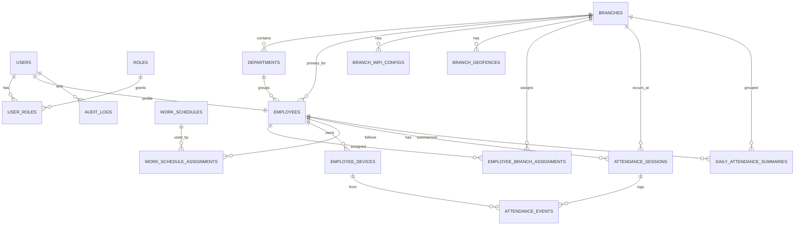

# SMART ATTENDANCE — ERD & DATABASE SCHEMA

> Schema thiết kế cho PostgreSQL 16 + Prisma ORM. Hỗ trợ multi-branch, scale-ready cho 100 chi nhánh × 5.000 nhân viên.

---

## 1. Sơ đồ tổng thể



---

## 2. Nguyên tắc chung

- **PK:** `id` UUID v7 (sortable, tốt cho index B-tree)
- **Timestamp:** `created_at`, `updated_at` mặc định `now()`, lưu UTC
- **Soft delete:** dùng `status` enum thay vì `deleted_at` (đơn giản hơn, dễ filter)
- **Naming:** snake_case cho cột, plural cho bảng
- **Money/time:** lưu phút làm việc dưới dạng `INTEGER` (worked_minutes), không Decimal
- **JSON:** chỉ dùng `jsonb` cho field thật sự bán cấu trúc (`risk_flags`, `device_meta`)
- **Index:** mọi FK + mọi cột thường filter

---

## 3. Prisma schema (đầy đủ)

```prisma
// schema.prisma

generator client {
  provider = "prisma-client-js"
}

datasource db {
  provider = "postgresql"
  url      = env("DATABASE_URL")
}

// ===================== ENUMS =====================

enum UserStatus {
  active
  inactive
  suspended
}

enum RoleCode {
  admin
  manager
  employee
}

enum BranchStatus {
  active
  inactive
}

enum EmploymentStatus {
  active
  on_leave
  terminated
}

enum AssignmentType {
  primary
  secondary
  temporary
}

enum DevicePlatform {
  ios
  android
  web
}

enum AttendanceEventType {
  check_in
  check_out
}

enum AttendanceEventStatus {
  success
  failed
}

enum AttendanceSessionStatus {
  on_time
  late
  early_leave
  overtime
  missing_checkout
  absent
}

enum ValidationMethod {
  gps
  wifi
  gps_wifi
  none
}

enum AuditAction {
  create
  update
  delete
  override
  login
  logout
}

// ===================== IDENTITY =====================

model User {
  id            String     @id @default(uuid()) @db.Uuid
  email         String     @unique
  passwordHash  String     @map("password_hash")
  fullName      String     @map("full_name")
  phone         String?
  status        UserStatus @default(active)
  lastLoginAt   DateTime?  @map("last_login_at")
  createdAt     DateTime   @default(now()) @map("created_at")
  updatedAt     DateTime   @updatedAt @map("updated_at")

  employee  Employee?
  userRoles UserRole[]
  auditLogs AuditLog[]

  @@index([status])
  @@map("users")
}

model Role {
  id        String     @id @default(uuid()) @db.Uuid
  code      RoleCode   @unique
  name      String
  userRoles UserRole[]

  @@map("roles")
}

model UserRole {
  userId String @map("user_id") @db.Uuid
  roleId String @map("role_id") @db.Uuid

  user User @relation(fields: [userId], references: [id], onDelete: Cascade)
  role Role @relation(fields: [roleId], references: [id])

  @@id([userId, roleId])
  @@map("user_roles")
}

// ===================== ORGANIZATION =====================

model Branch {
  id            String       @id @default(uuid()) @db.Uuid
  code          String       @unique
  name          String
  address       String?
  latitude      Decimal      @db.Decimal(10, 7)
  longitude     Decimal      @db.Decimal(10, 7)
  radiusMeters  Int          @default(150) @map("radius_meters")
  timezone      String       @default("Asia/Ho_Chi_Minh")
  status        BranchStatus @default(active)
  createdAt     DateTime     @default(now()) @map("created_at")
  updatedAt     DateTime     @updatedAt @map("updated_at")

  departments        Department[]
  wifiConfigs        BranchWifiConfig[]
  geofences          BranchGeofence[]
  primaryEmployees   Employee[]                    @relation("PrimaryBranch")
  assignments        EmployeeBranchAssignment[]
  attendanceSessions AttendanceSession[]
  dailySummaries     DailyAttendanceSummary[]

  @@index([status])
  @@map("branches")
}

model Department {
  id        String   @id @default(uuid()) @db.Uuid
  branchId  String   @map("branch_id") @db.Uuid
  name      String
  code      String?
  createdAt DateTime @default(now()) @map("created_at")

  branch    Branch     @relation(fields: [branchId], references: [id], onDelete: Cascade)
  employees Employee[]

  @@unique([branchId, name])
  @@index([branchId])
  @@map("departments")
}

model Employee {
  id                String           @id @default(uuid()) @db.Uuid
  userId            String           @unique @map("user_id") @db.Uuid
  employeeCode      String           @unique @map("employee_code")
  departmentId     String?          @map("department_id") @db.Uuid
  primaryBranchId  String           @map("primary_branch_id") @db.Uuid
  employmentStatus EmploymentStatus @default(active) @map("employment_status")
  joinedAt         DateTime         @default(now()) @map("joined_at")
  createdAt        DateTime         @default(now()) @map("created_at")
  updatedAt        DateTime         @updatedAt @map("updated_at")

  user            User                       @relation(fields: [userId], references: [id], onDelete: Cascade)
  department      Department?                @relation(fields: [departmentId], references: [id])
  primaryBranch   Branch                     @relation("PrimaryBranch", fields: [primaryBranchId], references: [id])
  assignments     EmployeeBranchAssignment[]
  devices         EmployeeDevice[]
  scheduleAssigns WorkScheduleAssignment[]
  sessions        AttendanceSession[]
  dailySummaries  DailyAttendanceSummary[]

  @@index([primaryBranchId])
  @@index([departmentId])
  @@index([employmentStatus])
  @@map("employees")
}

model EmployeeBranchAssignment {
  id            String         @id @default(uuid()) @db.Uuid
  employeeId    String         @map("employee_id") @db.Uuid
  branchId      String         @map("branch_id") @db.Uuid
  assignmentType AssignmentType @default(secondary) @map("assignment_type")
  effectiveFrom DateTime       @map("effective_from") @db.Date
  effectiveTo   DateTime?      @map("effective_to") @db.Date
  createdAt     DateTime       @default(now()) @map("created_at")

  employee Employee @relation(fields: [employeeId], references: [id], onDelete: Cascade)
  branch   Branch   @relation(fields: [branchId], references: [id], onDelete: Cascade)

  @@index([employeeId, effectiveFrom, effectiveTo])
  @@index([branchId])
  @@map("employee_branch_assignments")
}

// ===================== LOCATION CONFIG =====================

model BranchWifiConfig {
  id        String   @id @default(uuid()) @db.Uuid
  branchId  String   @map("branch_id") @db.Uuid
  ssid      String
  bssid     String?
  isActive  Boolean  @default(true) @map("is_active")
  priority  Int      @default(0)
  notes     String?
  createdAt DateTime @default(now()) @map("created_at")

  branch Branch @relation(fields: [branchId], references: [id], onDelete: Cascade)

  @@index([branchId, isActive])
  @@index([bssid])
  @@map("branch_wifi_configs")
}

model BranchGeofence {
  id           String   @id @default(uuid()) @db.Uuid
  branchId     String   @map("branch_id") @db.Uuid
  name         String
  centerLat    Decimal  @map("center_lat") @db.Decimal(10, 7)
  centerLng    Decimal  @map("center_lng") @db.Decimal(10, 7)
  radiusMeters Int      @map("radius_meters")
  isActive     Boolean  @default(true) @map("is_active")
  createdAt    DateTime @default(now()) @map("created_at")

  branch Branch @relation(fields: [branchId], references: [id], onDelete: Cascade)

  @@index([branchId, isActive])
  @@map("branch_geofences")
}

// ===================== DEVICES =====================

model EmployeeDevice {
  id                String         @id @default(uuid()) @db.Uuid
  employeeId        String         @map("employee_id") @db.Uuid
  deviceFingerprint String         @map("device_fingerprint")
  platform          DevicePlatform
  deviceName        String?        @map("device_name")
  appVersion        String?        @map("app_version")
  isTrusted         Boolean        @default(false) @map("is_trusted")
  lastSeenAt        DateTime?      @map("last_seen_at")
  createdAt         DateTime       @default(now()) @map("created_at")

  employee Employee           @relation(fields: [employeeId], references: [id], onDelete: Cascade)
  events   AttendanceEvent[]

  @@unique([employeeId, deviceFingerprint])
  @@index([employeeId])
  @@map("employee_devices")
}

// ===================== SCHEDULE =====================

model WorkSchedule {
  id                   String   @id @default(uuid()) @db.Uuid
  name                 String
  startTime            String   @map("start_time") // "08:00"
  endTime              String   @map("end_time")   // "17:00"
  graceMinutes         Int      @default(10) @map("grace_minutes")
  overtimeAfterMinutes Int      @default(60) @map("overtime_after_minutes")
  workdays             Json     // [1,2,3,4,5] = Mon-Fri
  createdAt            DateTime @default(now()) @map("created_at")

  assignments WorkScheduleAssignment[]

  @@map("work_schedules")
}

model WorkScheduleAssignment {
  id            String    @id @default(uuid()) @db.Uuid
  employeeId    String    @map("employee_id") @db.Uuid
  scheduleId    String    @map("schedule_id") @db.Uuid
  effectiveFrom DateTime  @map("effective_from") @db.Date
  effectiveTo   DateTime? @map("effective_to") @db.Date
  createdAt     DateTime  @default(now()) @map("created_at")

  employee Employee     @relation(fields: [employeeId], references: [id], onDelete: Cascade)
  schedule WorkSchedule @relation(fields: [scheduleId], references: [id])

  @@index([employeeId, effectiveFrom, effectiveTo])
  @@map("work_schedule_assignments")
}

// ===================== ATTENDANCE =====================

model AttendanceSession {
  id              String                  @id @default(uuid()) @db.Uuid
  employeeId      String                  @map("employee_id") @db.Uuid
  branchId        String                  @map("branch_id") @db.Uuid
  workDate        DateTime                @map("work_date") @db.Date
  checkInAt       DateTime?               @map("check_in_at")
  checkOutAt      DateTime?               @map("check_out_at")
  workedMinutes   Int?                    @map("worked_minutes")
  overtimeMinutes Int?                    @map("overtime_minutes")
  status          AttendanceSessionStatus @default(on_time)
  trustScore      Int?                    @map("trust_score") // điểm thấp nhất giữa check-in/out
  createdAt       DateTime                @default(now()) @map("created_at")
  updatedAt       DateTime                @updatedAt @map("updated_at")

  employee Employee          @relation(fields: [employeeId], references: [id])
  branch   Branch            @relation(fields: [branchId], references: [id])
  events   AttendanceEvent[]

  @@unique([employeeId, workDate])
  @@index([branchId, workDate])
  @@index([workDate, status])
  @@map("attendance_sessions")
}

model AttendanceEvent {
  id              String                @id @default(uuid()) @db.Uuid
  sessionId       String?               @map("session_id") @db.Uuid
  employeeId      String                @map("employee_id") @db.Uuid
  branchId        String?               @map("branch_id") @db.Uuid
  deviceId        String?               @map("device_id") @db.Uuid
  eventType       AttendanceEventType   @map("event_type")
  status          AttendanceEventStatus
  validationMethod ValidationMethod     @default(none) @map("validation_method")
  trustScore      Int                   @map("trust_score")
  latitude        Decimal?              @db.Decimal(10, 7)
  longitude       Decimal?              @db.Decimal(10, 7)
  accuracyMeters  Int?                  @map("accuracy_meters")
  ssid            String?
  bssid           String?
  ipAddress       String?               @map("ip_address")
  riskFlags       Json?                 @map("risk_flags") // ["mock_location","vpn_suspected"]
  rejectReason    String?               @map("reject_reason")
  deviceMeta      Json?                 @map("device_meta")
  createdAt       DateTime              @default(now()) @map("created_at")

  session AttendanceSession? @relation(fields: [sessionId], references: [id], onDelete: Cascade)
  device  EmployeeDevice?    @relation(fields: [deviceId], references: [id])

  @@index([sessionId, createdAt])
  @@index([employeeId, createdAt])
  @@index([branchId, createdAt])
  @@index([status, createdAt])
  @@map("attendance_events")
}

model DailyAttendanceSummary {
  id              String                  @id @default(uuid()) @db.Uuid
  employeeId      String                  @map("employee_id") @db.Uuid
  branchId        String                  @map("branch_id") @db.Uuid
  workDate        DateTime                @map("work_date") @db.Date
  status          AttendanceSessionStatus
  workedMinutes   Int                     @default(0) @map("worked_minutes")
  overtimeMinutes Int                     @default(0) @map("overtime_minutes")
  lateMinutes     Int                     @default(0) @map("late_minutes")
  trustScoreAvg   Int?                    @map("trust_score_avg")
  createdAt       DateTime                @default(now()) @map("created_at")

  employee Employee @relation(fields: [employeeId], references: [id])
  branch   Branch   @relation(fields: [branchId], references: [id])

  @@unique([employeeId, workDate])
  @@index([branchId, workDate])
  @@index([workDate, status])
  @@map("daily_attendance_summaries")
}

// ===================== AUDIT =====================

model AuditLog {
  id         String      @id @default(uuid()) @db.Uuid
  userId     String?     @map("user_id") @db.Uuid
  action     AuditAction
  entityType String      @map("entity_type")
  entityId   String?     @map("entity_id")
  before     Json?
  after      Json?
  ipAddress  String?     @map("ip_address")
  userAgent  String?     @map("user_agent")
  createdAt  DateTime    @default(now()) @map("created_at")

  user User? @relation(fields: [userId], references: [id])

  @@index([userId, createdAt])
  @@index([entityType, entityId])
  @@map("audit_logs")
}
```

---

## 4. Index strategy

| Bảng | Index | Mục đích |
|---|---|---|
| `attendance_sessions` | UNIQUE `(employee_id, work_date)` | Đảm bảo 1 session/ngày, lookup nhanh |
| `attendance_sessions` | `(branch_id, work_date)` | Manager dashboard |
| `attendance_sessions` | `(work_date, status)` | Báo cáo theo ngày + status |
| `attendance_events` | `(session_id, created_at)` | Audit trail từng session |
| `attendance_events` | `(employee_id, created_at)` | Lịch sử cá nhân |
| `attendance_events` | `(branch_id, created_at)` | Anomaly detection theo branch |
| `attendance_events` | `(status, created_at)` | Filter failed events |
| `branch_wifi_configs` | `(branch_id, is_active)` | Lookup khi validate check-in |
| `branch_wifi_configs` | `(bssid)` | Reverse lookup BSSID → branch |
| `branch_geofences` | `(branch_id, is_active)` | Lookup geofence |
| `daily_attendance_summaries` | UNIQUE `(employee_id, work_date)` | Idempotent cron job |
| `employee_branch_assignments` | `(employee_id, effective_from, effective_to)` | Check active assignment |

---

## 5. Partition strategy (cho scale)

`attendance_events` sẽ tăng nhanh nhất:
- 5.000 nhân viên × 2 events/ngày × 365 ngày = **3.65 triệu rows/năm**
- Cộng failed attempts (~30%) → ~5 triệu/năm

**Partition theo `RANGE (created_at)` theo tháng:**

```sql
CREATE TABLE attendance_events (
  -- columns
) PARTITION BY RANGE (created_at);

CREATE TABLE attendance_events_2026_04 PARTITION OF attendance_events
  FOR VALUES FROM ('2026-04-01') TO ('2026-05-01');
```

**Lợi ích:**
- Query gần đây chỉ scan partition hiện tại
- Archive/drop partition cũ dễ dàng
- Vacuum chạy nhanh hơn

> Trong MVP: **không bật partition** (Prisma chưa hỗ trợ tốt). Mô tả trong README như scale plan, có sẵn migration script tay.

---

## 6. Materialized data — `daily_attendance_summaries`

Thay vì query join `attendance_sessions + attendance_events` mỗi lần render dashboard, cron job 00:30 ghi sẵn vào `daily_attendance_summaries`.

**Lợi ích:**
- Dashboard query đơn giản, tốc độ predict được
- Có thể replace bằng materialized view sau này
- Tách trách nhiệm: events = source of truth, summaries = read model

---

## 7. Quy tắc nghiệp vụ phản ánh trong schema

| Rule (spec) | Implement trong DB |
|---|---|
| 1 session/ngày/nhân viên | UNIQUE `(employee_id, work_date)` |
| Mọi attempt log lại | `attendance_events` rời với `status = success/failed` |
| Trust score đa lớp | `attendance_events.trust_score` + `risk_flags jsonb` |
| GPS hoặc WiFi | `validation_method` enum: `gps | wifi | gps_wifi | none` |
| Nhân viên đa chi nhánh | `employee_branch_assignments` với `effective_from/to` |
| Audit override của manager | `audit_logs` ghi before/after |
| Soft inactive | `status` enum thay vì delete |

---

## 8. Migration strategy

- **Init migration:** tạo toàn bộ schema + seed roles + 1 admin
- **Seed script:** 3 branches, 3 departments, 30 employees, 1 work_schedule, 7 ngày data
- **Mỗi PR đổi schema:** kèm migration mới, không sửa migration cũ
- **Production:** dùng `prisma migrate deploy` (không `db push`)

---

## 9. Câu query mẫu (verify performance)

### Lịch sử cá nhân tháng 4
```sql
SELECT * FROM attendance_sessions
WHERE employee_id = $1
  AND work_date BETWEEN '2026-04-01' AND '2026-04-30'
ORDER BY work_date DESC;
-- dùng index UNIQUE (employee_id, work_date)
```

### Dashboard chi nhánh hôm nay
```sql
SELECT status, COUNT(*) FROM attendance_sessions
WHERE branch_id = $1 AND work_date = CURRENT_DATE
GROUP BY status;
-- dùng index (branch_id, work_date)
```

### Anomaly: failed events 7 ngày
```sql
SELECT branch_id, COUNT(*) FROM attendance_events
WHERE status = 'failed' AND created_at >= NOW() - INTERVAL '7 days'
GROUP BY branch_id ORDER BY 2 DESC LIMIT 10;
-- dùng index (status, created_at) + (branch_id, created_at)
```

---

## 10. Changelog

- **v0.1** (2026-04-15): Khởi tạo từ spec v0.1.
