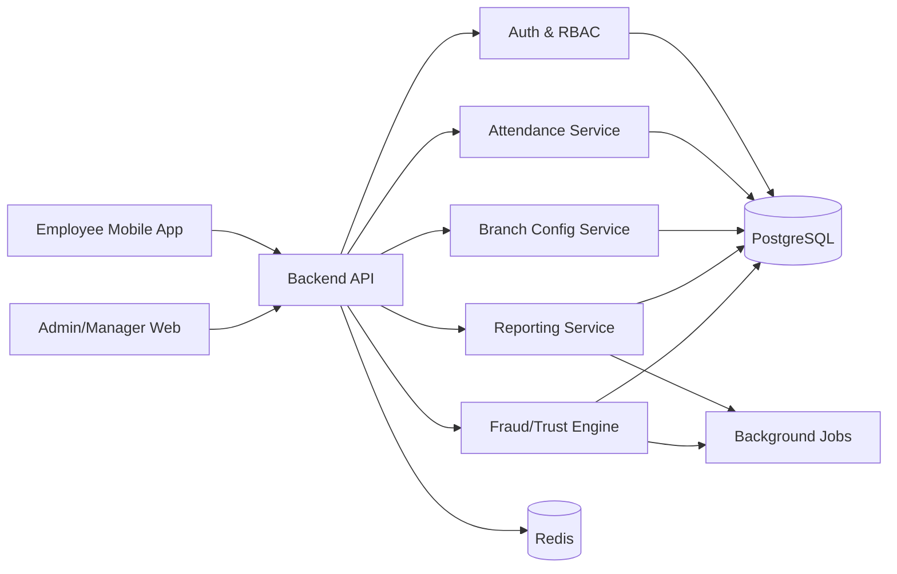
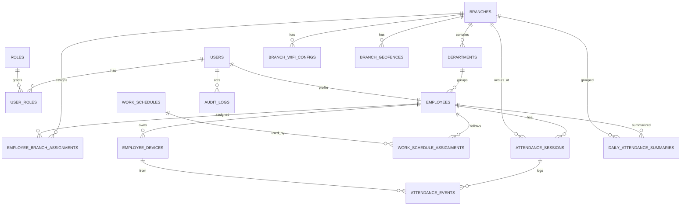

Dưới đây là cách **phân tích đề bài** và **những việc nên làm trước tiên** để không bị sa vào code sớm nhưng lại thiếu điểm ở kiến trúc, Git Flow, Docker và AI workflow.

---

# 1) Đọc đề theo đúng “ý đồ chấm điểm”

Đây không chỉ là bài “làm app chấm công”, mà là bài kiểm tra 5 thứ cùng lúc:

### A. Làm được sản phẩm thực tế
Bạn phải có đủ các trục chính:
- check-in / check-out
- xác thực vị trí bằng WiFi hoặc GPS
- quản lý chi nhánh
- lịch sử / báo cáo
- dashboard
- phân quyền admin / manager / employee

### B. Thiết kế có tư duy scale
Đề nhấn mạnh rất rõ:
- **100 chi nhánh**
- **5.000 nhân viên**
- **giờ cao điểm check-in đồng thời**
- schema hỗ trợ multi-branch
- API có pagination/filter
- README phải giải thích scale strategy

Tức là họ không chỉ xem “có chạy không”, mà còn xem bạn có tư duy **system design** hay không.

### C. Quy trình làm việc chuyên nghiệp
Không chỉ code:
- Git Flow phải đúng
- Docker phải chạy one-command
- có `.env.example`
- có context file cho AI IDE
- có `PROMPT_LOG.md`

Điểm này rất nhiều đội hay mất vì chỉ tập trung code.

### D. Biết dùng AI đúng quy trình
Đề không chấm “dùng AI cho vui”, mà chấm:
- có spec trước khi generate
- có review/refine
- có test
- có log prompt
- có context file ở root

### E. Có yếu tố sáng tạo
25% điểm là cực lớn. Nghĩa là nếu chỉ làm đủ CRUD + dashboard cơ bản, rất dễ bị hòa lẫn với các đội khác.

---

# 2) Bóc tách yêu cầu thành 4 lớp

Nếu nhìn đúng, bài này có 4 lớp công việc:

## Lớp 1: Business flow
Các luồng chính phải chạy mượt:
- nhân viên đăng nhập
- check-in/check-out
- xem lịch sử cá nhân
- manager xem nhân viên chi nhánh
- admin quản lý toàn hệ thống

## Lớp 2: Data & rule engine
Phần quan trọng không nằm ở UI mà ở logic:
- chi nhánh nào hợp lệ với WiFi nào / geofence nào
- nhân viên thuộc chi nhánh nào
- ca làm / giờ làm chuẩn
- thế nào là đúng giờ / trễ / vắng / overtime
- một ngày có được check-in nhiều lần không
- check-out thiếu thì xử lý sao
- làm việc liên chi nhánh thì xử lý sao

## Lớp 3: Security / anti-fraud
Đề gọi tên rất rõ:
- fake GPS
- VPN

Nghĩa là bạn phải có **chiến lược chống gian lận**, dù chưa cần chống tuyệt đối 100%.

## Lớp 4: Engineering quality
Đây là phần để ăn điểm “đội giải pháp số”:
- kiến trúc rõ
- có scale-ready design
- Git Flow bài bản
- Docker hóa tốt
- README tốt
- prompt log rõ ràng

---

# 3) Cái bẫy lớn nhất của đề

Nhiều đội sẽ lao vào làm UI check-in trước. Nhưng bài này dễ mất điểm ở 4 chỗ sau:

## Bẫy 1: Không chốt rule ngay từ đầu
Ví dụ:
- một nhân viên có thể thuộc nhiều chi nhánh không?
- work from branch khác có được không?
- WiFi và GPS là AND hay OR?
- nếu mất GPS nhưng đúng WiFi thì có cho chấm công?
- nếu check-in đúng nhưng quên check-out thì tính thế nào?

Nếu không định nghĩa sớm, code xong sẽ vỡ model.

## Bẫy 2: Làm app CRUD nhưng không ra “smart attendance”
Nếu chỉ:
- chọn chi nhánh
- bấm check-in
- lưu DB

thì chưa ra giá trị “thông minh”. Phải có:
- geofence / WiFi validation
- fraud detection
- trạng thái công
- dashboard có insight

## Bẫy 3: Bỏ quên phần chấm điểm không phải code
Rất nhiều điểm nằm ở:
- `README`
- `docker-compose`
- `CLAUDE.md` / `.cursorrules` / `copilot-instructions.md`
- `PROMPT_LOG.md`
- branch history

Nếu đến cuối mới làm, thường sẽ rất sơ sài.

## Bẫy 4: Ôm quá nhiều tính năng
Chỉ có **5 ngày**. Nếu làm quá rộng:
- mobile app riêng
- realtime socket phức tạp
- bản đồ cầu kỳ
- AI camera face recognition
- payroll đầy đủ

thì rất dễ dở dang.

---

# 4) Nên hiểu “MVP đạt điểm cao” là gì

Một MVP tốt cho đề này không phải là “ít tính năng”, mà là:

### Phần bắt buộc phải chắc
- đăng nhập + phân quyền
- quản lý chi nhánh
- cấu hình WiFi/GPS cho chi nhánh
- gán nhân viên vào chi nhánh
- check-in/check-out có validation
- lịch sử chấm công
- dashboard cơ bản
- báo cáo có filter + phân trang
- Docker chạy được
- README + Prompt Log + Context file đầy đủ

### Phần scale-ready phải thể hiện được
- schema multi-branch
- API phân trang
- index DB hợp lý
- design cho high-traffic peak hour
- mô tả anti-fraud strategy
- mô tả hướng scale app/server/DB

### Phần sáng tạo nên có 1–2 ý thật rõ
Đừng có 8 ý nhỏ. Hãy chọn 1–2 ý “đập vào mắt”.
Ví dụ:
- **Attendance Trust Score**: chấm điểm độ tin cậy của lần check-in dựa trên GPS, WiFi, tốc độ di chuyển, lịch sử thiết bị
- **Anomaly Detection Dashboard**: cảnh báo chi nhánh có tỷ lệ check-in bất thường, trễ tăng cao, nhiều lần thất bại do fake GPS
- **Branch Health View**: bản đồ/tổng quan cho admin thấy tỷ lệ đúng giờ theo chi nhánh
- **Offline-safe check-in draft**: lưu tạm local khi mạng kém rồi đồng bộ sau, có đánh dấu trạng thái xác minh

---

# 5) Việc nên làm trước tiên: không phải code, mà là chốt thiết kế

Thứ tự đúng trong vài giờ đầu nên là:

## Bước 1: Chốt scope “must-have / should-have / bonus”
Bạn nên tách ngay 3 tầng:

| Mức | Nội dung |
|---|---|
| Must-have | Auth, phân quyền, branch CRUD, employee assignment, WiFi/GPS validation, check-in/out, history, dashboard cơ bản, Docker, README |
| Should-have | anti-fake GPS cơ bản, overtime calculation, export report, filter nâng cao |
| Bonus | trust score, anomaly detection, map dashboard, offline mode, notification |

Việc này cực quan trọng vì chỉ có 5 ngày.

---

## Bước 2: Viết mini-spec nghiệp vụ trước
Trước khi tạo project, hãy viết một file spec ngắn trả lời rõ:

### Attendance rules
- 1 nhân viên thuộc 1 hay nhiều chi nhánh?
- check-in hợp lệ khi thỏa WiFi **hoặc** GPS, hay phải cả hai?
- nếu check-in ngoài vùng nhưng đúng WiFi thì sao?
- có ca làm cố định không?
- late tính từ phút nào?
- overtime tính thế nào?
- absence xác định vào lúc nào?
- có cho check-in nhiều thiết bị không?

### Security rules
- phát hiện fake GPS bằng cách nào?
- VPN dùng để làm gì trong logic gian lận?
- có lưu device fingerprint không?
- có limit số lần check-in thất bại không?

### Reporting rules
- báo cáo theo ngày/tuần/tháng cần những chỉ số gì?
- ai được xem dữ liệu nào?

Nếu không có spec này, AI IDE sẽ generate sai rất nhanh.

---

## Bước 3: Chốt kiến trúc ở mức vừa đủ
Trong 5 ngày, nên chọn kiến trúc **đủ mạnh nhưng không quá nặng**.

Một hướng rất hợp lý:

### Option thực dụng, dễ hoàn thành
- **Frontend:** Next.js
- **Backend:** NestJS hoặc Express/Fastify
- **DB:** PostgreSQL
- **Cache/queue:** Redis (nếu kịp)
- **Auth:** JWT
- **ORM:** Prisma / TypeORM
- **Docker:** frontend + backend + postgres (+ redis)

Vì sao hợp:
- dễ demo
- dễ Docker
- dễ chia module
- đủ để nói về scale

Nếu đội mạnh fullstack JS thì đây là lựa chọn an toàn.

---

## Bước 4: Chốt domain model trước UI
Đây là phần nên làm rất sớm.

Ít nhất phải có các entity chính:

- `users`
- `roles`
- `branches`
- `branch_wifi_configs`
- `branch_geofences`
- `departments`
- `employees`
- `employee_branch_assignments`
- `work_schedules`
- `attendance_records`
- `attendance_events`
- `devices` hoặc `employee_devices`
- `audit_logs`

### Tư duy đúng:
- `attendance_records` là bản ghi ngày công / phiên công
- `attendance_events` là log sự kiện check-in/check-out/failed attempts
- WiFi và geofence nên là cấu hình riêng của branch
- employee assignment nên tách bảng, đừng hard-code 1 khóa ngoại đơn giản nếu muốn scale rule sau này

---

# 6) Thứ tự triển khai thông minh trong 5 ngày

## Ngày 1: Chốt spec + data model + repo standards
Mục tiêu của ngày 1 không phải “ra app đẹp”, mà là:
- chốt nghiệp vụ
- chốt kiến trúc
- tạo repo chuẩn
- tạo Docker skeleton
- tạo context file cho AI IDE
- tạo backlog task rõ ràng

Nếu ngày 1 mà chưa có:
- ERD
- module list
- API list
- branch strategy
- file hướng dẫn AI

thì về sau rất dễ rối.

---

## Ngày 2: Làm xương sống backend
Ưu tiên:
- auth + RBAC
- branch CRUD
- employee assignment
- attendance validation flow
- history APIs
- pagination/filter

Đây là phần ăn điểm kiến trúc mạnh nhất.

---

## Ngày 3: Frontend và check-in flow
Ưu tiên:
- login
- check-in/out page
- manager branch view
- admin dashboard cơ bản
- lịch sử cá nhân

Đừng cầu kỳ animation trước.

---

## Ngày 4: Báo cáo + anti-fraud + polish
Ưu tiên:
- late/absence/overtime logic
- dashboard metrics
- export CSV/PDF nếu kịp
- fake GPS/VPN/device rule cơ bản
- UX hoàn thiện

---

## Ngày 5: README + Prompt Log + video demo + cleanup
Ngày cuối thường quyết định cảm nhận giám khảo.
Phải hoàn thiện:
- README thật rõ
- kiến trúc + scale strategy
- Docker chạy 1 lệnh
- context file
- `PROMPT_LOG.md`
- demo script 5–10 phút
- branch history sạch

---

# 7) Những việc nên làm ngay trong 2–4 giờ đầu tiên

Nếu bạn hỏi “trước tiên làm gì”, thì đây là checklist thực chiến nhất:

## Việc 1: Viết 1 trang “Product Spec v0.1”
Nội dung chỉ cần:
- user roles
- luồng check-in/check-out
- rule WiFi/GPS
- anti-fraud assumptions
- báo cáo cần gì
- danh sách bonus feature

Mục tiêu: để cả team và AI IDE cùng hiểu đúng.

---

## Việc 2: Chọn tech stack dứt khoát
Không nên mất nửa ngày tranh luận.
Chọn theo năng lực đội, ưu tiên:
- nhanh dựng
- nhanh Docker
- dễ demo
- dễ scale narrative

---

## Việc 3: Vẽ ERD sơ bộ
Chỉ cần mức:
- branch
- employee
- assignment
- attendance
- event
- geofence
- wifi config
- role

Làm xong ERD rồi mới generate model/schema.

---

## Việc 4: Tạo repo với chuẩn làm việc ngay
Khởi tạo ngay:
- `main`
- `develop`
- `feature/...`

Tạo luôn:
- `.env.example`
- `README.md`
- `CLAUDE.md` hoặc `.cursorrules`
- `PROMPT_LOG.md`

Đây là phần rất dễ bị quên nhưng đề chấm trực tiếp.

---

## Việc 5: Viết backlog theo user stories
Ví dụ:
- Admin quản lý chi nhánh
- Admin cấu hình WiFi/GPS cho chi nhánh
- Admin gán nhân viên vào chi nhánh
- Nhân viên check-in/out
- Manager xem nhân sự chi nhánh
- Admin xem dashboard hệ thống
- Người dùng xem lịch sử chấm công

Sau đó mới chia branch `feature/*`.

---

## Việc 6: Quyết định “điểm khác biệt”
Chọn sớm 1 ý sáng tạo để kiến trúc bám theo.
Nếu chọn muộn, thường sẽ thành “gắn thêm cho có”.

---

# 8) Một hướng sáng tạo dễ ăn điểm mà vẫn khả thi

Tôi gợi ý bạn chọn concept:

## **Smart Attendance = Attendance + Trust + Insight**

Tức là không chỉ ghi nhận giờ vào/ra, mà còn đánh giá **độ tin cậy** và **bất thường**.

### Có thể thêm 2 tính năng bonus rất hợp đề:
**Attendance Trust Score**
- mỗi lần check-in có điểm tin cậy
- dựa trên: GPS hợp lệ, WiFi hợp lệ, tốc độ di chuyển, thiết bị quen thuộc, lịch sử bất thường
- hiện màu xanh/vàng/đỏ cho manager/admin

**Anomaly Dashboard**
- chi nhánh nào có tỷ lệ đi trễ tăng bất thường
- ai có nhiều lần check-in thất bại
- ai check-in ở nhiều vị trí đáng ngờ
- top branch đúng giờ tốt nhất / kém nhất

Cái hay là:
- không quá khó để demo
- tạo cảm giác “smart”
- rất hợp tiêu chí sáng tạo + thương mại hóa

---

# 9) Gợi ý cấu trúc repo để ăn điểm sạch

Bạn nên tổ chức repo sao cho nhìn vào là thấy chuyên nghiệp:

```text
/
├─ apps/
│  ├─ web/
│  └─ api/
├─ docs/
│  ├─ architecture.md
│  ├─ erd.md
│  └─ api-spec.md
├─ docker/
├─ .env.example
├─ docker-compose.yml
├─ README.md
├─ CLAUDE.md (hoặc .cursorrules / copilot-instructions.md)
└─ PROMPT_LOG.md
```

Nếu monorepo được thì rất gọn cho Docker và tài liệu.

---

# 10) README cần có gì ngay từ đầu

Đừng để cuối mới viết. Hãy tạo khung README sớm với các mục:

- Giới thiệu bài toán
- Tính năng chính
- Kiến trúc tổng quan
- Tech stack
- Cách chạy bằng Docker
- Seed/demo accounts
- Scale strategy
- Anti-fraud strategy
- AI workflow
- Demo guide

Làm sớm để trong quá trình code, bạn bổ sung dần.

---

# 11) Context file cho AI IDE nên chứa gì

Vì đề chấm phần này, file context không nên viết chung chung.

Nó nên có:
- mục tiêu sản phẩm
- tech stack
- coding conventions
- folder structure
- naming conventions
- API response conventions
- DB conventions
- Git conventions
- testing conventions
- nguyên tắc: luôn review code AI sinh ra
- ưu tiên security, pagination, multi-branch

Tức là AI IDE phải được “huấn luyện theo dự án” ngay từ đầu.

---

# 12) PROMPT_LOG.md không nên ghi kiểu đối phó

Rất nhiều đội chỉ ghi:
- “Prompt 1: tạo login”
- “Prompt 2: sửa bug”

Kiểu này rất yếu.

Nên ghi theo format:
- **Mục tiêu**
- **Prompt đã dùng**
- **AI sinh ra gì**
- **Vấn đề phát hiện**
- **Cách review/chỉnh sửa**
- **Kết quả cuối cùng**

Như vậy mới chứng minh được bạn **biết dùng AI một cách có kiểm soát**.

---

# 13) Các quyết định quan trọng cần chốt càng sớm càng tốt

Bạn nên chốt sớm 7 quyết định này:

### 1. WiFi/GPS là điều kiện gì?
Khuyên dùng:
- hợp lệ nếu **WiFi hoặc GPS**
- nhưng nếu có cả hai thì trust score cao hơn

Như vậy thực tế hơn.

### 2. Fake GPS xử lý thế nào?
Không cần hứa chống tuyệt đối.
Chỉ cần có rule:
- flag thiết bị có mock location
- vị trí nhảy bất thường
- check-in ngoài geofence nhưng vẫn cố gửi
- dùng VPN + IP bất thường thì tăng risk

### 3. Mỗi nhân viên thuộc 1 hay nhiều chi nhánh?
Để đơn giản demo: có thể cho 1 branch chính + bảng assignment để mở rộng sau.

### 4. Có schedule không?
Nên có ít nhất:
- giờ vào chuẩn
- giờ ra chuẩn
- grace period vài phút
- overtime sau mốc nào

### 5. Dashboard cấp nào?
- employee: cá nhân
- manager: chi nhánh
- admin: toàn hệ thống

### 6. Báo cáo xuất gì?
Ít nhất:
- tổng ngày công
- số lần đúng giờ
- trễ
- vắng
- tổng giờ làm
- overtime

### 7. Dữ liệu demo
Nên seed:
- 3–5 chi nhánh
- vài chục nhân viên
- dữ liệu attendance mẫu
để dashboard nhìn “sống”.

---

# 14) Nếu chỉ được chọn 1 thứ làm đầu tiên, hãy làm cái này

Nếu thật sự cần câu trả lời ngắn gọn nhất:

## **Việc đầu tiên nên làm là chốt SPEC + ERD + BACKLOG**
Cụ thể:
1. viết rule nghiệp vụ ngắn gọn
2. vẽ schema dữ liệu
3. chia task theo feature
4. chọn 1 ý tưởng sáng tạo
5. rồi mới khởi tạo project và dùng AI generate

Làm đúng thứ tự này sẽ tiết kiệm rất nhiều thời gian sửa lại về sau.

---

# 15) Kế hoạch hành động đề xuất cho bạn ngay bây giờ

Nếu bạn chuẩn bị bắt tay vào làm, tôi khuyên thứ tự như sau:

### Trong 60 phút đầu
- chốt tech stack
- viết product spec 1 trang
- chọn 1 bonus feature
- tạo skeleton repo + Git Flow

### Trong 2 giờ tiếp theo
- vẽ ERD
- liệt kê API chính
- viết `CLAUDE.md` hoặc `.cursorrules`
- tạo `PROMPT_LOG.md`

### Trong nửa ngày đầu
- dựng Docker base
- dựng auth + role structure
- tạo schema DB
- seed dữ liệu mẫu

Đó là đường đi an toàn nhất.

---

Nếu bạn muốn, ở bước tiếp theo tôi có thể làm tiếp 1 trong 3 việc này cho bạn:

**A.** bóc đề thành **feature list + backlog 5 ngày**  
**B.** đề xuất **kiến trúc hệ thống + ERD + API list**  
**C.** viết sẵn **`README` khung + `CLAUDE.md` + `PROMPT_LOG.md` mẫu**

Nếu muốn nhanh nhất để bắt đầu implementation, tôi khuyên làm tiếp theo **B**.

Tuyệt, mình đi thẳng vào **B: đề xuất kiến trúc hệ thống + ERD + API list** theo hướng **đủ mạnh để ăn điểm kiến trúc**, nhưng vẫn **khả thi trong 5 ngày**.

---

# 1) Định hướng kiến trúc nên chọn trước

Mình khuyên bạn chọn mô hình:

## **Mobile-first cho chấm công, Web-first cho quản trị**

- **Nhân viên** check-in/check-out bằng **app mobile**
- **Admin/Manager** dùng **web dashboard**
- **Backend API** dùng chung cho cả mobile và web
- **PostgreSQL** làm database chính
- **Redis** dùng cho cache/rate limit/job queue nếu kịp
- **Object storage** chỉ cần nếu bạn muốn lưu export/report/file đính kèm

Lý do rất quan trọng: phần **WiFi SSID/BSSID** và **GPS/geofence** gắn chặt với API hệ điều hành. Trên Android, truy cập Wi‑Fi info bị ràng buộc bởi permission; Android 13+ có `NEARBY_WIFI_DEVICES`, nhưng một số Wi‑Fi API vẫn cần `ACCESS_FINE_LOCATION`. Với `WifiInfo`, BSSID có thể không trả được nếu thiếu quyền. Trên iOS, API `NEHotspotNetwork.fetchCurrent(...)` là hướng chính thức để lấy thông tin Wi‑Fi hiện tại như SSID/BSSID, và Core Location còn có khái niệm **reduced accuracy**, tức vị trí chỉ ở mức gần đúng. Vì vậy, nếu muốn làm bài “đúng bản chất kỹ thuật”, phần chấm công nên đi qua **mobile app**, không nên đặt trọng tâm vào check-in bằng web browser. [Android Wi‑Fi permissions](https://developer.android.com/develop/connectivity/wifi/wifi-permissions) [Android WifiInfo](https://developer.android.com/reference/android/net/wifi/WifiInfo) [Apple NEHotspotNetwork](https://developer.apple.com/documentation/NetworkExtension/NEHotspotNetwork/fetchCurrent(completionHandler:)) [Apple CLAccuracyAuthorization.reducedAccuracy](https://developer.apple.com/documentation/corelocation/claccuracyauthorization/reducedaccuracy)

---

# 2) Kiến trúc tổng thể đề xuất

## **Kiến trúc 3 lớp thực dụng**

### Lớp client
- **Mobile App**: nhân viên check-in/out, xem lịch sử cá nhân
- **Web Admin Portal**: admin/manager quản lý chi nhánh, nhân sự, dashboard, báo cáo

### Lớp backend
- **API Gateway / App Server**
- **Auth + RBAC module**
- **Attendance module**
- **Branch configuration module**
- **Reporting module**
- **Fraud detection / trust scoring module**
- **Audit log module**

### Lớp dữ liệu
- **PostgreSQL**
- **Redis** cho:
  - cache dashboard
  - rate limit
  - queue tạo báo cáo/export
- **Background jobs**
  - tổng hợp ngày công
  - cảnh báo bất thường
  - tạo file export

---

# 3) Sơ đồ khối nên trình bày trong README



Nếu muốn demo đẹp hơn, bạn có thể thêm một dòng giải thích:
- **Mobile** = nơi thu thập location/WiFi/device context
- **Backend** = nơi quyết định hợp lệ hay không
- **DB** = lưu record và event
- **Jobs** = tính overtime, tổng hợp dashboard, anomaly

---

# 4) Tech stack nên dùng

## Phương án khuyến nghị
- **Frontend web:** Next.js
- **Mobile:** React Native hoặc Flutter
- **Backend:** NestJS
- **ORM:** Prisma
- **DB:** PostgreSQL
- **Cache/queue:** Redis + BullMQ
- **Auth:** JWT access/refresh
- **Charts:** ECharts / Recharts
- **Docker:** docker-compose cho web + api + db + redis

## Vì sao phương án này hợp bài
- dễ chia module
- dễ dựng RBAC
- dễ làm API rõ ràng
- Prisma + Postgres rất hợp để mô tả ERD
- NestJS dễ “trông enterprise” khi đi thi
- Next.js làm dashboard nhanh
- React Native/Flutter hợp với bài toán location/WiFi

---

# 5) Nguyên tắc thiết kế nghiệp vụ nên chốt

Mình đề xuất rule như sau để vừa hợp lý vừa dễ code:

## Rule xác thực check-in/check-out
Một lần check-in hợp lệ khi:
- **GPS hợp lệ** theo geofence của chi nhánh, **hoặc**
- **WiFi hợp lệ** theo SSID/BSSID của chi nhánh

Nhưng hệ thống không chỉ trả **valid/invalid**, mà còn trả thêm:
- `validation_method`: `gps` | `wifi` | `gps_wifi`
- `trust_score`: 0–100
- `risk_flags`: danh sách cờ nghi ngờ

Cách này rất hay vì:
- hợp thực tế hơn AND cứng nhắc
- tạo ra yếu tố “smart”
- dễ mở rộng dashboard bất thường

## Rule chấm công ngày
- `on_time`
- `late`
- `absent`
- `early_leave`
- `overtime`

## Rule đơn giản nhưng mạnh
- mỗi nhân viên có **1 chi nhánh chính**
- vẫn hỗ trợ **assignment mở rộng** bằng bảng quan hệ
- mỗi ngày có thể có **1 attendance session chính**, nhưng vẫn log được nhiều event thất bại/thử lại

---

# 6) Luồng check-in/check-out chuẩn

## Check-in flow
1. Mobile lấy:
   - GPS
   - accuracy
   - timestamp
   - SSID/BSSID nếu có
   - device info
   - IP/network metadata
2. Gửi lên backend
3. Backend:
   - xác định ca làm hiện tại
   - lấy cấu hình branch của nhân viên
   - kiểm tra geofence
   - kiểm tra WiFi whitelist
   - chạy fraud rules
   - tính trust score
4. Nếu hợp lệ:
   - tạo `attendance_session`
   - tạo `attendance_event`
5. Nếu không hợp lệ:
   - vẫn tạo `attendance_event` dạng failed
   - trả lý do chi tiết cho client

## Check-out flow
- tương tự check-in
- update session hiện tại
- tính `worked_minutes`
- đánh dấu overtime nếu có

---

# 7) Anti-fraud nên thiết kế kiểu nào

Đề chỉ yêu cầu “chống gian lận”, không bắt bạn chống tuyệt đối. Vì vậy cách thông minh nhất là thiết kế **nhiều lớp kiểm tra nhẹ**.

## Mô hình 3 lớp

### Lớp 1: Validation cứng
- ngoài geofence
- WiFi không thuộc whitelist
- chưa được gán vào branch
- check-out khi chưa check-in

### Lớp 2: Risk flags
- location accuracy quá kém
- thiết bị mới/chưa tin cậy
- tốc độ di chuyển bất thường giữa 2 lần chấm công
- IP/VPN/network bất thường
- mock/simulated location signal từ OS nếu có

### Lớp 3: Trust score
Ví dụ:
- GPS hợp lệ: +40
- WiFi đúng BSSID: +35
- thiết bị tin cậy: +15
- accuracy tốt: +10
- reduced accuracy: -15
- simulated/mock: -50
- IP bất thường: -10

Trên Android, geofencing là mô hình chính thức để theo dõi proximity với vùng địa lý; tài liệu Android còn gợi ý dùng kiểu **dwell** để tránh trigger sai khi chỉ lướt qua khu vực. Trên iOS, reduced accuracy nghĩa là hệ thống chỉ cấp vị trí gần đúng; điều đó nên làm điểm tin cậy thấp hơn thay vì block tuyệt đối. iOS cũng có `isSimulatedBySoftware` để phát hiện tín hiệu vị trí được mô phỏng bằng phần mềm, rất phù hợp để đưa vào risk flag. [Android geofencing](https://developer.android.com/develop/sensors-and-location/location/geofencing) [Apple CLAccuracyAuthorization.reducedAccuracy](https://developer.apple.com/documentation/corelocation/claccuracyauthorization/reducedaccuracy) [Apple isSimulatedBySoftware](https://developer.apple.com/documentation/corelocation/cllocationsourceinformation/issimulatedbysoftware)

---

# 8) ERD đề xuất

Mình chia làm 3 cụm: **identity**, **branch config**, **attendance**.

## ERD lõi



---

# 9) Bảng dữ liệu nên có

## 9.1 Nhóm người dùng và phân quyền

### `users`
- `id`
- `email`
- `password_hash`
- `full_name`
- `phone`
- `status`
- `last_login_at`
- `created_at`
- `updated_at`

### `roles`
- `id`
- `code` = `admin | manager | employee`
- `name`

### `user_roles`
- `user_id`
- `role_id`

> Nếu muốn đơn giản, có thể để role trực tiếp trong `users`.  
> Nhưng để “trông enterprise” hơn thì tách bảng.

---

## 9.2 Nhóm tổ chức

### `branches`
- `id`
- `code`
- `name`
- `address`
- `latitude`
- `longitude`
- `radius_meters`
- `status`
- `timezone`
- `created_at`

### `departments`
- `id`
- `branch_id`
- `name`
- `code`

### `employees`
- `id`
- `user_id`
- `employee_code`
- `department_id`
- `primary_branch_id`
- `employment_status`
- `joined_at`

### `employee_branch_assignments`
- `id`
- `employee_id`
- `branch_id`
- `assignment_type` = `primary | secondary | temporary`
- `effective_from`
- `effective_to`

---

## 9.3 Nhóm cấu hình location

### `branch_wifi_configs`
- `id`
- `branch_id`
- `ssid`
- `bssid`
- `is_active`
- `priority`
- `notes`

### `branch_geofences`
- `id`
- `branch_id`
- `name`
- `center_lat`
- `center_lng`
- `radius_meters`
- `is_active`

> Có thể một branch có nhiều geofence:
- cổng chính
- tòa nhà A
- kho
- khu vực làm việc mở rộng

---

## 9.4 Nhóm thiết bị

### `employee_devices`
- `id`
- `employee_id`
- `device_fingerprint`
- `platform` = `ios | android`
- `device_name`
- `app_version`
- `is_trusted`
- `last_seen_at`

---

## 9.5 Nhóm lịch làm việc

### `work_schedules`
- `id`
- `name`
- `start_time`
- `end_time`
- `grace_minutes`
- `overtime_after_minutes`
- `workdays_json`

### `work_schedule_assignments`
- `id`
- `employee_id`
- `schedule_id`
- `effective_from`
- `effective_to`

---

## 9.6 Nhóm chấm công

### `attendance_sessions`
Đây là bảng chính để tính ngày công.
- `id`
- `employee_id`
- `branch_id`
- `work_date`
- `scheduled_start_at`
- `scheduled_end_at`
- `check_in_at`
- `check_out_at`
- `check_in_method`
- `check_out_method`
- `status` = `present | late | absent | incomplete | early_leave`
- `worked_minutes`
- `overtime_minutes`
- `trust_score_avg`
- `created_at`
- `updated_at`

### `attendance_events`
Đây là bảng log mọi hành động.
- `id`
- `attendance_session_id` nullable
- `employee_id`
- `branch_id`
- `device_id`
- `event_type` = `check_in_attempt | check_in_success | check_out_attempt | check_out_success | failed`
- `gps_lat`
- `gps_lng`
- `gps_accuracy`
- `ssid`
- `bssid`
- `ip_address`
- `network_type`
- `is_mock_location`
- `is_vpn_suspected`
- `validation_result`
- `validation_method`
- `trust_score`
- `risk_flags_json`
- `failure_reason`
- `captured_at`

### `daily_attendance_summaries`
- `id`
- `employee_id`
- `branch_id`
- `work_date`
- `status`
- `worked_minutes`
- `overtime_minutes`
- `late_minutes`
- `trust_score_avg`

> Nếu thời gian gấp, bảng này có thể chưa cần triển khai ngay; có thể tính từ `attendance_sessions`.  
> Nhưng nên **thiết kế sẵn** để ghi điểm scale.

---

## 9.7 Nhóm audit

### `audit_logs`
- `id`
- `actor_user_id`
- `action`
- `entity_type`
- `entity_id`
- `old_data_json`
- `new_data_json`
- `created_at`

---

# 10) Index quan trọng để scale

Phần này rất đáng ghi vào README.

## Index bắt buộc
- `attendance_sessions(employee_id, work_date desc)`
- `attendance_sessions(branch_id, work_date desc)`
- `attendance_events(employee_id, captured_at desc)`
- `attendance_events(branch_id, captured_at desc)`
- `daily_attendance_summaries(branch_id, work_date desc)`
- `employee_branch_assignments(employee_id, effective_from, effective_to)`
- `branch_wifi_configs(branch_id, is_active)`
- `branch_geofences(branch_id, is_active)`

## Unique/index hữu ích
- `users(email)` unique
- `employees(employee_code)` unique
- `branches(code)` unique
- `employee_devices(device_fingerprint)` unique hoặc partial unique
- `branch_wifi_configs(branch_id, bssid)` unique nếu muốn chặt

## Nếu dùng Postgres tốt hơn nữa
- index theo `work_date`
- partition `attendance_events` theo tháng nếu data lớn
- materialized view cho dashboard tổng hợp

---

# 11) API list nên có

Mình chia theo module để bạn dễ giao task và tạo feature branch.

---

# 11.1 Auth & Profile API

## Auth
- `POST /auth/login`
- `POST /auth/refresh`
- `POST /auth/logout`
- `GET /auth/me`

## Profile
- `GET /me/profile`
- `GET /me/attendance/today`
- `GET /me/attendance/history`
- `GET /me/attendance/stats`

---

# 11.2 Branch Management API

## Branch CRUD
- `GET /branches`
- `POST /branches`
- `GET /branches/:id`
- `PATCH /branches/:id`
- `DELETE /branches/:id`

### Query nên hỗ trợ
- `page`
- `limit`
- `search`
- `status`
- `sort_by`
- `sort_order`

## Department
- `GET /branches/:branchId/departments`
- `POST /branches/:branchId/departments`
- `PATCH /departments/:id`
- `DELETE /departments/:id`

---

# 11.3 Branch Location Config API

## WiFi config
- `GET /branches/:branchId/wifi-configs`
- `POST /branches/:branchId/wifi-configs`
- `PATCH /wifi-configs/:id`
- `DELETE /wifi-configs/:id`

## Geofence config
- `GET /branches/:branchId/geofences`
- `POST /branches/:branchId/geofences`
- `PATCH /geofences/:id`
- `DELETE /geofences/:id`

---

# 11.4 Employee & Assignment API

## Employee
- `GET /employees`
- `POST /employees`
- `GET /employees/:id`
- `PATCH /employees/:id`
- `DELETE /employees/:id`

## Assignment
- `GET /employees/:id/branches`
- `POST /employees/:id/branches`
- `PATCH /employee-branch-assignments/:id`
- `DELETE /employee-branch-assignments/:id`

## Device
- `GET /employees/:id/devices`
- `POST /employees/:id/devices/register`
- `PATCH /devices/:id/trust`
- `DELETE /devices/:id`

---

# 11.5 Schedule API

- `GET /schedules`
- `POST /schedules`
- `GET /schedules/:id`
- `PATCH /schedules/:id`
- `DELETE /schedules/:id`

- `POST /employees/:id/schedule-assignments`
- `GET /employees/:id/schedule-assignments`

---

# 11.6 Attendance API

Đây là nhóm API quan trọng nhất.

## Check-in/check-out
- `POST /attendance/check-in`
- `POST /attendance/check-out`

### Request body gợi ý cho check-in
```json
{
  "captured_at": "2026-04-10T08:01:12Z",
  "gps": {
    "lat": 10.776,
    "lng": 106.700,
    "accuracy": 18.5
  },
  "wifi": {
    "ssid": "Office-HCM-5F",
    "bssid": "AA:BB:CC:DD:EE:FF"
  },
  "device": {
    "fingerprint": "hashed-device-id",
    "platform": "android",
    "app_version": "1.0.0"
  },
  "network": {
    "ip": "1.2.3.4",
    "type": "wifi",
    "vpn_suspected": false
  },
  "signals": {
    "is_mock_location": false,
    "is_simulated": false,
    "location_accuracy_mode": "full"
  }
}
```

### Response nên trả
```json
{
  "success": true,
  "data": {
    "attendance_session_id": "uuid",
    "status": "late",
    "validation_method": "gps_wifi",
    "trust_score": 87,
    "risk_flags": [],
    "check_in_at": "2026-04-10T08:01:13Z"
  }
}
```

## Attendance queries
- `GET /attendance/my-history`
- `GET /attendance`
- `GET /attendance/:id`
- `GET /attendance/events`
- `GET /attendance/today-overview`

### Filter nên có
- `branch_id`
- `department_id`
- `employee_id`
- `status`
- `date_from`
- `date_to`
- `page`
- `limit`

---

# 11.7 Reporting API

## Summary
- `GET /reports/attendance-summary`
- `GET /reports/attendance-by-branch`
- `GET /reports/attendance-by-department`
- `GET /reports/late-ranking`
- `GET /reports/overtime-summary`

## Export
- `POST /reports/export`
- `GET /reports/export/:jobId`

> Nếu thiếu thời gian, `export` có thể chỉ xuất CSV.

---

# 11.8 Dashboard API

## Admin dashboard
- `GET /dashboard/admin/overview`
- `GET /dashboard/admin/branch-performance`
- `GET /dashboard/admin/attendance-trend`
- `GET /dashboard/admin/anomalies`

## Manager dashboard
- `GET /dashboard/manager/overview`
- `GET /dashboard/manager/team-status-today`
- `GET /dashboard/manager/late-employees`
- `GET /dashboard/manager/anomalies`

## Employee dashboard
- `GET /dashboard/employee/overview`

---

# 11.9 Audit & Ops API

- `GET /audit-logs`
- `GET /health`
- `GET /metrics` nếu muốn show tư duy production-ready

---

# 12) Quyền truy cập theo role

## Admin
- toàn quyền
- xem toàn hệ thống
- CRUD branch/config/employee/schedule
- xem mọi báo cáo

## Manager
- chỉ xem branch mình quản lý
- xem employee thuộc branch
- xem báo cáo branch
- không sửa cấu hình hệ thống toàn cục

## Employee
- chỉ check-in/out
- xem lịch sử cá nhân
- xem trạng thái ngày công của mình

Bạn nên enforce ở cả:
- middleware/guard
- query scope ở service layer

---

# 13) Chuẩn response API nên thống nhất

## Success
```json
{
  "success": true,
  "message": "Check-in successful",
  "data": {}
}
```

## Pagination
```json
{
  "success": true,
  "data": {
    "items": [],
    "pagination": {
      "page": 1,
      "limit": 20,
      "total_items": 5000,
      "total_pages": 250
    }
  }
}
```

## Error
```json
{
  "success": false,
  "message": "Check-in failed",
  "error_code": "OUTSIDE_GEOFENCE",
  "details": {
    "risk_flags": ["outside_geofence"]
  }
}
```

---

# 14) Dashboard nên có những chỉ số nào

## Toàn hệ thống
- tổng số nhân viên
- số đang present hôm nay
- số late hôm nay
- số absent hôm nay
- tổng overtime tuần/tháng
- top chi nhánh đúng giờ tốt nhất
- top chi nhánh có rủi ro cao nhất

## Theo chi nhánh
- attendance rate
- late rate
- average trust score
- số lần check-in thất bại
- danh sách nhân viên bất thường

---

# 15) “Điểm sáng tạo” nên gắn ngay vào kiến trúc

Mình khuyên bạn thêm 2 module sáng tạo nhưng rất khả thi:

## A. **Trust Score Engine**
Input:
- GPS valid?
- WiFi valid?
- accuracy tốt?
- reduced accuracy?
- thiết bị trusted?
- simulated/mock?
- VPN/IP bất thường?

Output:
- `trust_score`
- `risk_flags`

## B. **Anomaly Dashboard**
Từ `attendance_events` và `attendance_sessions`, tạo:
- nhân viên có nhiều lần failed check-in
- branch có late rate tăng đột biến
- thiết bị lạ check-in nhiều lần
- trust score thấp lặp lại

Điểm hay là bạn không cần AI model thật; chỉ cần **rule-based anomaly detection** là đã đủ “smart”.

---

# 16) Scale strategy nên viết gì trong README

Phần này rất quan trọng để ăn điểm kiến trúc.

## Cho 100 chi nhánh, 5.000 nhân viên
Bạn có thể ghi chiến lược như sau:

- **Stateless API servers** để scale ngang
- **PostgreSQL** với index theo `branch_id`, `employee_id`, `work_date`
- **Redis cache** cho dashboard query nặng
- **Background jobs** cho export/reporting
- **Tách event log và session summary**
  - `attendance_events` cho raw log
  - `attendance_sessions` / `daily_attendance_summaries` cho query nhanh
- **Pagination + filter ở mọi list API**
- **Branch-scoped queries** để manager không quét toàn hệ thống
- Có thể partition `attendance_events` theo tháng khi volume tăng

---

# 17) Thứ tự implement tốt nhất

## Phase 1 — nền tảng
- auth
- role
- branch CRUD
- employee CRUD
- assignment
- geofence/wifi config

## Phase 2 — attendance core
- check-in
- check-out
- validation GPS/WiFi
- event log
- history list

## Phase 3 — report & dashboard
- summary
- branch dashboard
- overtime/late stats
- anomaly/trust score

## Phase 4 — polish
- export
- seed data
- responsive UI
- audit logs
- README / demo

---

# 18) Kết luận chốt phương án

Nếu bạn cần một phương án **vừa đúng đề, vừa dễ triển khai trong 5 ngày**, thì mình khuyên chốt như sau:

- **Web dashboard + Mobile attendance**
- **NestJS + PostgreSQL + Prisma + Redis**
- **Next.js cho admin/manager**
- **React Native/Flutter cho employee**
- **Attendance theo session + event log**
- **Validation theo GPS hoặc WiFi**
- **Fraud detection kiểu risk flags + trust score**
- **Dashboard có anomaly để tạo điểm khác biệt**

Đây là cấu trúc đủ để:
- đạt feature bắt buộc
- thể hiện multi-branch & scale thinking
- có anti-fraud
- có điểm sáng tạo rõ
- dễ chuyển thành README, ERD, API spec và task breakdown

---

Nếu muốn, bước tiếp theo mình có thể làm ngay 1 trong 3 thứ này cho bạn:

**1.** Viết luôn **ERD dạng bảng chi tiết + Prisma schema draft**  
**2.** Viết **API spec dạng REST chuẩn** để team/backend code ngay  
**3.** Chia thành **backlog 5 ngày + feature branch list + conventional commits**

Nếu muốn đi nhanh vào implementation, mình khuyên tiếp theo là **1: Prisma schema draft**.